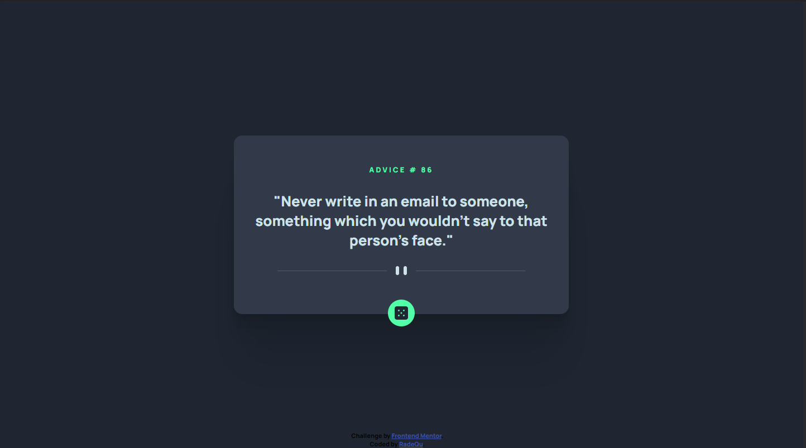

# Frontend Mentor - Advice generator app solution

This is a solution to the [Advice generator app challenge on Frontend Mentor](https://www.frontendmentor.io/challenges/advice-generator-app-QdUG-13db). Frontend Mentor challenges help you improve your coding skills by building realistic projects.

## Table of contents

- [Overview](#overview)
  - [Screenshot](#screenshot)
  - [Links](#links)
- [My process](#my-process)
  - [Built with](#built-with)
  - [Useful resources](#useful-resources)
- [Author](#author)

**Note: Delete this note and update the table of contents based on what sections you keep.**

## Overview

### Screenshot

### Links

- Solution URL: (https://github.com/RadeQu/JuniorFrontendProjects/tree/adviceGeneratorAppProject)
- Live Site URL: (https://transcendent-duckanoo-c10b66.netlify.app)

## My process

### Built with

- Semantic HTML5 markup
- CSS custom properties
- Flexbox
- CSS Grid
- Javascript 
- Fetch API 

### Useful resources

- [Fetch Api res 1](https://developer.mozilla.org/en-US/docs/Learn/JavaScript/Objects/JSON) - This helped me for append API to my code
- [Fetch Api res 2](https://developer.mozilla.org/en-US/docs/Learn/JavaScript/Objects/JSON#populating_the_header ) - This helped me for append API to my code also

## Author

- Frontend Mentor - (https://www.frontendmentor.io/profile/RadeQu)
- GitHub - (https://github.com/RadeQu))

